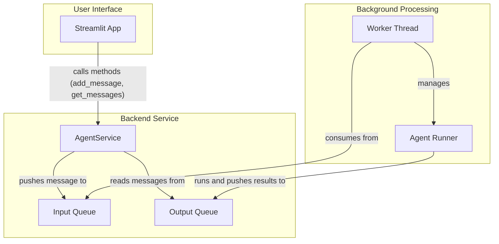
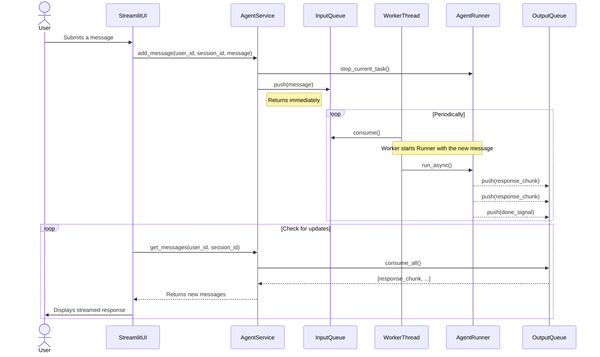

# Feature Specification: Asynchronous Agent Architecture with Streamlit UI

**Feature Branch**: `011-i-want-to`
**Created**: 2025-10-19
**Status**: Draft
**Input**: User description: "I want to build almost from scratch to change the architecture: 1. Streamlit APP just create 1. talk_session with settings in the side bar, 2. if some text submitted in chat_input, call add_message, 3. call get_messages and view it 2. Agent Service has create_talk_session, list_sessions, add_message, get_messages methods 3. create_session returns talk_session_id 4. add_message with talk_session_id stop current runner and push messages to the input queue 5. worker thread consume input queue and run with it (runner) 6. runner can be stopped 7. runner.run_async loop push to the output queue 8. get_messages return histories and new messages in streaming way"

---

## Architectural Decisions & Rationale

1.  **Decoupled Architecture:** The core architecture separates the Streamlit UI from the background agent processing. This is essential for two reasons:
    *   **UI Responsiveness:** It prevents the UI from freezing while the agent is working.
    *   **State Management:** It protects the long-running agent task from being interrupted or terminated when the Streamlit UI script reruns due to user interaction. The `AgentService` acts as a stable, long-lived controller.

2.  **Polling for Communication:** The Streamlit UI uses a polling mechanism (a short, periodic refresh) to check for new messages from the background service. This choice was made for the following reasons:
    *   **Rationale:** Polling is the simplest and most reliable way to achieve live, streaming updates within the standard Streamlit execution model. Any long-running or blocking process within a Streamlit script (such as waiting on a generator) is vulnerable to being terminated by user interaction. Polling uses a series of short, stateless checks that are immune to this interruption problem.
    *   **Trade-off:** We accept that polling is less efficient than a push-based system (like WebSockets) as a trade-off for the rapid development and simplicity that the Streamlit framework provides.

---

## Architecture Diagrams

### Component Diagram
This diagram shows the main components: the UI, the Service, the Queues, and the background Worker.



### Sequence Diagram
This diagram shows the dynamic flow of how a message is processed, highlighting the asynchronous nature of the system.



---
## Component Lifecycles

This section clarifies the lifetime and scope of each major component.

| Component | Lifecycle Scope | Explanation |
| :--- | :--- | :--- |
| **AgentService** | **Application** | Acts as a singleton, created once when the Streamlit app starts. It holds all talk sessions and manages the worker. Lives until the app process is stopped. |
| **Worker Thread** | **Application** | Started once by the `AgentService` at launch. Runs continuously in the background, processing tasks from the `InputQueue` until the app shuts down. |
| **Input/Output Queues** | **Application** | Created once with the `AgentService`. They are the central, thread-safe communication channels and exist as long as the application is running. |
| **TalkSession Data** | **Managed by Service** | Created by `AgentService` and stored within it. Exists in memory as long as the application is running. **Note**: Data is lost on application restart. |
| **Streamlit Session** | **User Session** | Unique to each user/browser tab. Holds UI state, like the current `user_id` and `talk_session_id`. Destroyed when the user closes the tab. |
| **Agent Runner** | **Per Task (Transient)** | Created by the `Worker Thread` for a single task. It is discarded after the task is complete. Its lifecycle is very short. |

### Lifecycle Scope Diagram

This diagram illustrates the relationship between the long-lived Application Scope and the transient User Sessions.

```mermaid
graph TD
    subgraph "Application Scope (Lives as long as the `streamlit run` process)"
        direction LR
        Singleton_Service[AgentService (Singleton)]
        Worker[Worker Thread]
        Queues[Input/Output Queues]

        Singleton_Service -- manages --> Worker
        Singleton_Service -- owns --> Queues
    end

    subgraph "User A"
        SessionA[Streamlit User Session A]
    end

    subgraph "User B"
        SessionB[Streamlit User Session B]
    end

    SessionA -- "communicates with" --> Singleton_Service
    SessionB -- "communicates with" --> Singleton_Service

    style Singleton_Service fill:#d4edda,stroke:#155724
    style Worker fill:#d4edda,stroke:#155724
    style Queues fill:#d4edda,stroke:#155724
```

---

## User Scenarios & Testing *(mandatory)*

### Primary User Story
As a user, I want to interact with an agent through a web interface. I can start a new conversation, send messages, and see the agent's responses in real-time. I also want to be able to manage my own conversation sessions without seeing sessions from other users.

### Acceptance Scenarios
1.  **Given** I am a new user on the Streamlit application, **When** I start a new talk session, **Then** a unique session is created for my user ID and I can see the chat interface.
2.  **Given** I have an active talk session, **When** I type a message and submit it, **Then** my message appears in the chat history and the agent's response is streamed back.
3.  **Given** I have multiple talk sessions, **When** I view the list of sessions, **Then** I only see sessions belonging to my user ID.
4.  **Given** another user has active sessions, **When** I use the application, **Then** I cannot view or interact with their sessions.

### Edge Cases
-   What happens if the worker thread crashes?
-   How does the system handle a rapid succession of user messages?
-   What is the behavior if `get_messages` is called for a non-existent `talk_session_id` for a given user?

---

## Requirements *(mandatory)*

### Functional Requirements
-   **FR-001**: The system MUST provide a Streamlit web application as the user interface.
-   **FR-002**: The UI MUST have a sidebar for settings and listing a user's own talk sessions.
-   **FR-003**: The Agent Service MUST expose a `create_talk_session` method that takes a `user_id` and returns a unique `talk_session_id`.
-   **FR-004**: The Agent Service MUST expose a `list_sessions` method that takes a `user_id` and returns only the sessions for that user.
-   **FR-005**: The Agent Service MUST expose an `add_message` method that takes a `user_id`, `talk_session_id`, and a message.
-   **FR-006**: The `add_message` method MUST stop any currently running agent task for that session.
-   **FR-007**: The `add_message` method MUST push the new message to an input queue for the corresponding session.
-   **FR-008**: A dedicated worker thread MUST consume messages from the input queue to run the agent logic.
-   **FR-009**: The agent runner MUST be stoppable.
-   **FR-010**: The agent's asynchronous execution (`run_async`) MUST push results to an output queue.
-   **FR-011**: The Agent Service MUST expose a `get_messages` method that takes a `user_id` and `talk_session_id` to retrieve chat history and stream new messages.
-   **FR-012**: The Streamlit app MUST display messages retrieved from `get_messages`.
-   **FR-013**: The system MUST NOT allow a user to list, view, or modify sessions belonging to another user.

### Non-Functional Requirements
-   **NFR-001**: The system MUST maintain user session state across interactions within the web application.
-   **NFR-002**: The system MUST ensure that concurrent operations on the same talk session do not lead to data corruption or inconsistent states.
-   **NFR-003**: The system MUST gracefully handle errors within the agent's background processing and communicate failures to the user in a clear manner.
-   **NFR-004**: The system MUST ensure that background processes are terminated cleanly when the application is shut down.

### Key Entities *(include if feature involves data)*
-   **User**: Represents an end-user, identified by a unique `user_id`.
-   **TalkSession**: Represents a single conversation. It has a unique ID, is associated with a `user_id`, and contains a history of messages.
-   **Message**: Represents a single message in a `TalkSession`, containing the content and sender (user or agent).
-   **InputQueue**: A queue that holds incoming user messages waiting to be processed by the agent.
-   **OutputQueue**: A queue that holds agent responses to be streamed to the user.

---

## Review & Acceptance Checklist
*GATE: Automated checks run during main() execution*

### Content Quality
- [X] No implementation details (languages, frameworks, APIs)
- [X] Focused on user value and business needs
- [X] Written for non-technical stakeholders
- [X] All mandatory sections completed

### Requirement Completeness
- [ ] No [NEEDS CLARIFICATION] markers remain
- [X] Requirements are testable and unambiguous
- [X] Success criteria are measurable
- [X] Scope is clearly bounded
- [ ] Dependencies and assumptions identified

---

## Execution Status
*Updated by main() during processing*

- [X] User description parsed
- [X] Key concepts extracted
- [ ] Ambiguities marked
- [X] User scenarios defined
- [X] Requirements generated
- [X] Entities identified
- [ ] Review checklist passed

---
